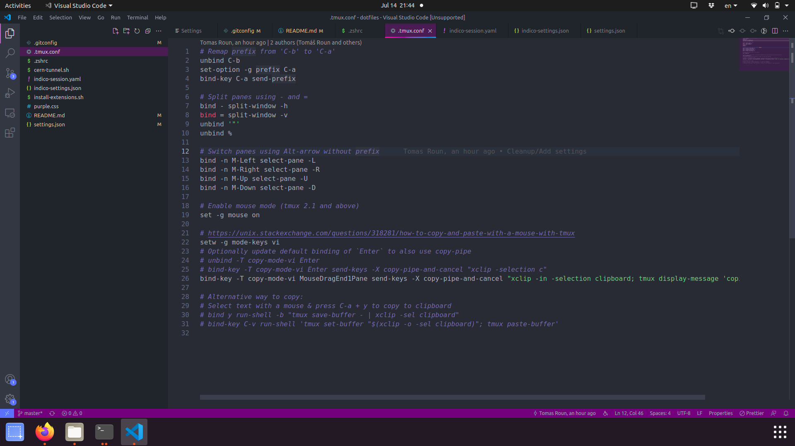
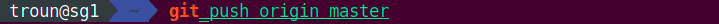

# dotfiles

## git

- Mostly just shortening commands to single letters e.g. `git commit -> git c` etc.

## tmux

- Rebinding the action key from `CTRL-B` to `CTRL-A`,
- `ALT + arrow keys` for pane navigation
- Automatically copy to clipboard your mouse selection

## VS Code

- Some global settings
- List of installed extensions which I can just bulk-install
- Custom CSS styles to make VS Code a bit nicer (Requires the `Custom CSS and JS Loader` extension)

This is what it looks like:

## zsh

- Plugins: git, syntax highlight & auto suggestions
- Automatically activates/deacticates Python venv when `cd`-ing into directory containing one
- Some custom highlighting for specific commands and tokens

This what the auto suggestions look like together with the custom highlighting:

## Work related

- The command to SSH tunnel (I always forget)
- tmuxp session for one of my work [projects](https://github.com/indico/indico)
